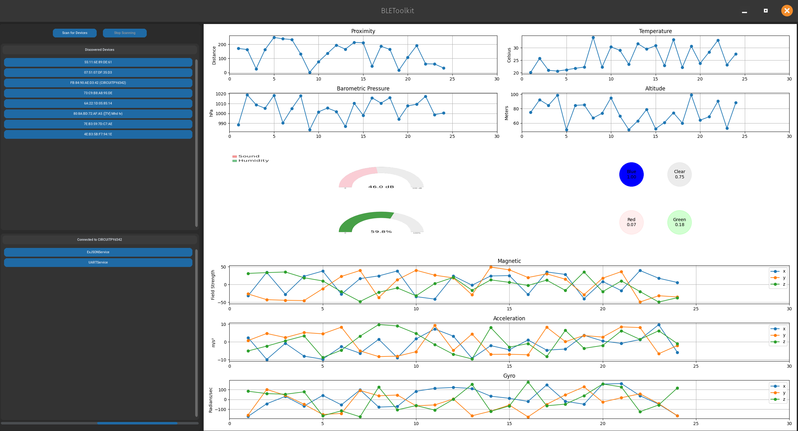

# ExJSONService Example

This document provides an example implementation of a JSON-based BLE service and its corresponding GUI integration using the PyBLEToolkit. The ExJSONService demonstrates how to handle various sensor data and visualize it in a user-friendly interface.

## Overview

Below is an example of what the graphical visualization looks like:



The `ExJSONService` example includes:
- A BLE service (`ExJSONService`) that provides sensor data in JSON format.
- A GUI tab (`ExJSONServiceTab`) to visualize the sensor data using matplotlib and pygal.

## Service Implementation

The `ExJSONService` class inherits from `AbstractService` and defines the BLE characteristics for the sensor data. See [ExJSONService](../../src/exemples/ble_json_service.py).

## GUI Implementation

The `ExJSONServiceTab` class inherits from `AbstractServiceTab` and provides a visual representation of the sensor data using matplotlib and pygal. See [ExJSONServiceTab](../../src/exemples/ble_json_service.py).

## Protocol

The `ExJSONService` class provides sensor data in JSON format, structured as follows:

```json
{
  "Sensors": {
    "Proximity": "value",
    "Temperature": "value C",
    "Barometric_pressure": "value",
    "Altitude": "value m",
    "Color": {
      "Red": "value",
      "Green": "value",
      "Blue": "value",
      "Clear": "value"
    },
    "Sound_level": "value",
    "Magnetic": {
      "x": "value",
      "y": "value",
      "z": "value"
    },
    "Acceleration": {
      "x": "value",
      "y": "value",
      "z": "value"
    },
    "Gyro": {
      "x": "value",
      "y": "value",
      "z": "value"
    },
    "Humidity": "value %"
  }
}
```

### Sensor Data

- **Proximity**: Distance measurement.
- **Temperature**: Temperature in Celsius.
- **Barometric_pressure**: Barometric pressure in hPa.
- **Altitude**: Altitude in meters.
- **Color**: RGB and Clear intensity values.
- **Sound_level**: Sound level in decibels.
- **Magnetic**: Magnetic field strength along x, y, and z axes.
- **Acceleration**: Acceleration along x, y, and z axes.
- **Gyro**: Gyroscope readings along x, y, and z axes.
- **Humidity**: Humidity percentage.

## Usage

To use the `ExJSONService` and `ExJSONServiceTab`, register them in the `SERVICE_REGISTER` dictionary as follows:

```python
# In src/__init__.py
from src.examples.ble_json_service import ExJSONService, ExJSONServiceTab

SERVICE_REGISTER: Dict[Type[AbstractService], Type[AbstractServiceTab]] = {
    ExJSONService: ExJSONServiceTab,
    # ...
}
```

Once registered, you can run the application and connect to the ExJSONService to visualize the sensor data.

## Authors

- [muhamm-ad · GitHub](https://github.com/muhamm-ad)

## Acknowledgments

The UUIDs used in this example are for demonstration purposes only.

### Testing

This example has been tested with the Adafruit Feather nRF52840 Sense (Product ID: 4516) sending JSON data with the following code:

```python
from src.abstract_service_tab import AbstractServiceTab
from adafruit_ble.uuid import VendorUUID
from adafruit_ble.characteristics import Characteristic
from adafruit_ble.characteristics.json import JSONCharacteristic
import time
import board

# TODO: 
```