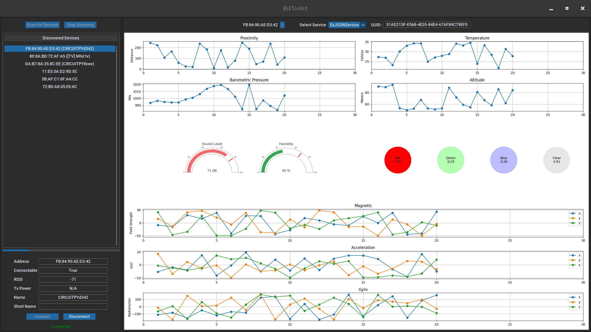

# ExJSONService Example

This document provides an example implementation of a JSON-based BLE service and its corresponding GUI integration using
the PyBLEToolkit.
The ExJSONService demonstrates how to handle various sensor data and visualize it in a user-friendly
interface.

## Overview

An example of what the graphical visualization looks like:



The [ExJSONService](../../src/exemples/ble_json_service.py) example includes:

- A BLE service (`ExJSONService`) that provides sensor data in JSON format.
- A GUI tab (`ExJSONServiceTab`) to visualize the sensor data using matplotlib and pygal.

## Service Implementation

The `ExJSONService` class inherits from [AbstractService](../../src/abstract_service.py) and defines the BLE
characteristics for the sensor data.

## GUI Implementation

The `ExJSONServiceTab` class inherits from [AbstractServiceTab](../../src/abstract_service_tab.py) and provides a visual
representation of the sensor data using matplotlib and pygal.

## Protocol

The `ExJSONService` class provides sensor data in JSON format, structured as follows:

```json
{
  "Sensors": {
    "Proximity": "value",
    "Temperature": "value C",
    "Barometric_pressure": "value",
    "Altitude": "value m",
    "Color": {
      "Red": "value",
      "Green": "value",
      "Blue": "value",
      "Clear": "value"
    },
    "Sound_level": "value",
    "Magnetic": {
      "x": "value",
      "y": "value",
      "z": "value"
    },
    "Acceleration": {
      "x": "value",
      "y": "value",
      "z": "value"
    },
    "Gyro": {
      "x": "value",
      "y": "value",
      "z": "value"
    },
    "Humidity": "value %"
  }
}
```

### Sensor Data

- **Proximity**: Distance measurement.
- **Temperature**: Temperature in Celsius.
- **Barometric_pressure**: Barometric pressure in hPa.
- **Altitude**: Altitude in meters.
- **Color**: RGB and Clear intensity values.
- **Sound_level**: Sound level in decibels.
- **Magnetic**: Magnetic field strength along x, y, and z axes.
- **Acceleration**: Acceleration along x, y, and z axes.
- **Gyro**: Gyroscope readings along x, y, and z axes.
- **Humidity**: Humidity percentage.

## Usage

Before you begin, ensure you have the following python packages installed:

```
matplotlib
numpy
pillow
plotly
kaleido
```

To use the `ExJSONService` and `ExJSONServiceTab`, register them in the `SERVICE_REGISTER` dictionary as follows:

```python
# In src/service_register.py
# ...

SERVICE_REGISTER: Dict[Type[AbstractService], Type[AbstractServiceTab]] = {
    ExJSONService: ExJSONServiceTab,
    # ...
}
```

Once registered, you can run the application and connect to the ExJSONService to visualize the sensor data.

### Testing

This example has been tested with the Adafruit Feather nRF52840 Sense (Product ID: 4516) sending JSON data with the
following code:

```python
from adafruit_sht31d import SHT31D
from adafruit_lis3mdl import LIS3MDL
from adafruit_bmp280 import Adafruit_BMP280_I2C
from adafruit_apds9960.apds9960 import APDS9960
from adafruit_ble import BLERadio
from adafruit_ble.advertising.standard import ProvideServicesAdvertisement

# Note: use the same service implemented in GUI (AbstractService and ExJSONService)
from utils import ExJSONService

import audiobusio
import board
import math
import array
import time
import json

ble = BLERadio()
ble.stop_advertising()  # stop any persistent old advertisement

ble_service = ExJSONService()
ble_advertisement = ProvideServicesAdvertisement(ble_service)
ble.start_advertising(ble_advertisement)

i2c = board.I2C()  # uses board.SCL and board.SDA

# check for LSM6DS33 or LSM6DS3TR-C
try:
    from adafruit_lsm6ds.lsm6ds33 import LSM6DS33 as LSM6DS

    lsm6ds = LSM6DS(i2c)
except RuntimeError:
    from adafruit_lsm6ds.lsm6ds3 import LSM6DS3 as LSM6DS

    lsm6ds = LSM6DS(i2c)

apds9960 = APDS9960(i2c)
bmp280 = Adafruit_BMP280_I2C(i2c)
lis3mdl = LIS3MDL(i2c)
sht31d = SHT31D(i2c)
microphone = audiobusio.PDMIn(board.MICROPHONE_CLOCK, board.MICROPHONE_DATA,
                              sample_rate=16000, bit_depth=16)


def normalized_rms(values):
    minbuf = int(sum(values) / len(values))
    return int(math.sqrt(sum(float(sample - minbuf) *
                             (sample - minbuf) for sample in values) / len(values)))


apds9960.enable_proximity = True
apds9960.enable_color = True

# Set this to sea level pressure in hectoPascals at your location for accurate altitude reading.
bmp280.sea_level_pressure = 1013.25

last_connection_time = time.time()

# Main loop for generating and processing data
while True:
    samples = array.array('H', [0] * 160)
    microphone.record(samples, len(samples))

    sensor_data = {
        "Sensors": {
            "Proximity": apds9960.proximity,
            "Temperature": f"{bmp280.temperature:.1f} C",
            "Barometric_pressure": bmp280.pressure,
            "Altitude": f"{bmp280.altitude:.1f} m",
            "Color": {
                "Red": apds9960.color_data[0],
                "Green": apds9960.color_data[1],
                "Blue": apds9960.color_data[2],
                "Clear": apds9960.color_data[3]
            },
            "Sound_level": normalized_rms(samples),
            "Magnetic": {
                "x": f"{lis3mdl.magnetic[0]:.3f}",
                "y": f"{lis3mdl.magnetic[1]:.3f}",
                "z": f"{lis3mdl.magnetic[2]:.3f}"
            },
            "Acceleration": {
                "x": f"{lsm6ds.acceleration[0]:.2f}",
                "y": f"{lsm6ds.acceleration[1]:.2f}",
                "z": f"{lsm6ds.acceleration[2]:.2f}"
            },
            "Gyro": {
                "x": f"{lsm6ds.gyro[0]:.2f}",
                "y": f"{lsm6ds.gyro[1]:.2f}",
                "z": f"{lsm6ds.gyro[2]:.2f}"
            },
            "Humidity": f"{sht31d.relative_humidity:.1f} %"
        }
    }

    if ble.connected:
        last_connection_time = time.time()
        # Convert dictionary to JSON string
        ble_service.data = json.dumps(sensor_data)
    else:
        elapsed_time = time.time() - last_connection_time
        if elapsed_time > 1:
            ble.stop_advertising()
            # print("Device disconnected for more than 1 seconds. Stopping advertisement.")
            time.sleep(0.5)

            # Wait for a new connection
            ble.start_advertising(ble_advertisement)
            while not ble.connected:
                time.sleep(0.5)
            # print("Device reconnected. Resuming data transmission.")
            last_connection_time = time.time()

    time.sleep(1)
```

## Authors

- [muhamm-ad · GitHub](https://github.com/muhamm-ad)

## Acknowledgments

The UUIDs used in this example are for demonstration purposes only.