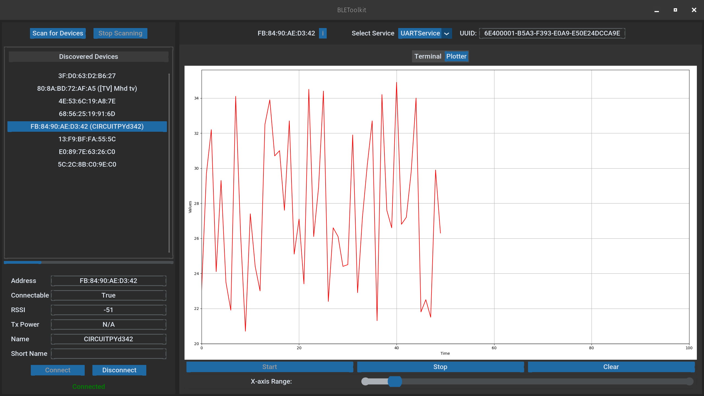

# UARTService Example

This document provides an example implementation of a UART-based BLE service and its corresponding GUI integration using the PyBLEToolkit. The UARTService demonstrates how to handle UART data and visualize it in a user-friendly interface.

## Overview

Below is an example of what the graphical visualization looks like:

<div style="display: flex; justify-content: space-around;">
    
    
</div>

The [UARTService](../../src/exemples/ble_uart_service.py) example includes:
- A BLE service (`UARTService`) that communicates via UART.
- A GUI tab (`UARTServiceTab`) to visualize the UART data using matplotlib and a terminal interface.

## Service Implementation

The `UARTService` class inherits from `NordicUARTService` and [AbstractService](src/abstract_service.py) to define the BLE characteristics for UART communication.

## GUI Implementation

The `UARTServiceTab` class inherits from [AbstractServiceTab](src/abstract_service_tab.py) and provides a visual representation of the UART data using matplotlib for plotting and a customtkinter-based terminal interface.

It is composed of two tab views:
- **Terminal**: This tab provides a native UART terminal GUI based on customtkinter, allowing users to send and receive data. It includes features like text/hex view mode, terminal mode, and auto-scroll.
- **Plotter**: This tab plots incoming floating-point numbers using matplotlib and customtkinter. It features controls to start and stop plotting, clear the plot, and adjust the x-axis range.

### Data Format

The data transmitted and received is in plain text format. Ensure the data sent conforming to the expected format for proper parsing and visualization.

Here is an example of the data format expected by the `UARTPlotterTab`:

```plaintext
1.0
2.5
3.8
...
```

## Usage

Before you begin, ensure you have the following python packages installed:

```
matplotlib
```

We register the `UARTService` with the corresponding tab GUI `UARTServiceTab` in the `SERVICE_REGISTER` dictionary as follows:

```python
# In src/service_register.py
# ...

SERVICE_REGISTER: Dict[Type[AbstractService], Type[AbstractServiceTab]] = {
    UARTService: UARTServiceTab,
}
```

### Testing

This example has been tested with the Adafruit Feather nRF52840 Sense (Product ID: 4516) sending temperature data with the following code:

```python
from adafruit_bmp280 import Adafruit_BMP280_I2C
from adafruit_ble import BLERadio
from adafruit_ble.advertising.standard import ProvideServicesAdvertisement

# Note: use the same service implemented in GUI (AbstractService and UARTService)
from utils import UARTService

import board
import time

ble = BLERadio()
ble.stop_advertising()  # stop any persistent old advertisement

uart_service = UARTService()
uart_advertisement = ProvideServicesAdvertisement(uart_service)

i2c = board.I2C()  # uses board.SCL and board.SDA
bmp280 = Adafruit_BMP280_I2C(i2c)
# Set this to sea level pressure in hectoPascals at your location for accurate altitude reading.
bmp280.sea_level_pressure = 1013.25

last_connection_time = time.time()

# Main loop for generating and processing data
while True:
    if ble.connected:
        last_connection_time = time.time()
        uart_service.write((f"{bmp280.temperature: .1f}" + '\n').encode())
    else:
        elapsed_time = time.time() - last_connection_time
        if elapsed_time > 1:
            ble.stop_advertising()
            # print("Device disconnected for more than 1 seconds. Stopping advertisement.")
            time.sleep(0.5)

            # Wait for a new connection
            ble.start_advertising(uart_advertisement)
            while not ble.connected:
                time.sleep(0.5)
            # print("Device reconnected. Resuming data transmission.")
            last_connection_time = time.time()

    time.sleep(0.5)
```

## Authors

- [muhamm-ad · GitHub](https://github.com/muhamm-ad)