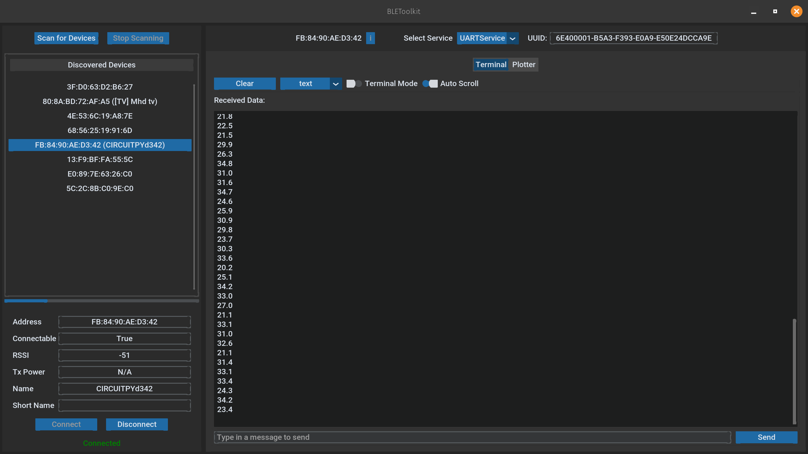

# UARTService Example

This document provides an example implementation of a UART-based BLE service and its corresponding GUI integration using the PyBLEToolkit. The UARTService demonstrates how to handle UART data and visualize it in a user-friendly interface.

## Overview

Below is an example of what the graphical visualization looks like:

<div style="display: flex; justify-content: space-around;">
    
    
</div>

The `UARTService` example includes:
- A BLE service (`UARTService`) that communicates via UART.
- A GUI tab (`UARTServiceTab`) to visualize the UART data using matplotlib and a terminal interface.

## Service Implementation

The `UARTService` class inherits from `NordicUARTService` and `AbstractService` to define the BLE characteristics for UART communication. See [UARTService](../../src/exemples/ble_uart_service.py).

## GUI Implementation

The `UARTServiceTab` class inherits from `ServiceTab` and provides a visual representation of the UART data using matplotlib for plotting and a customtkinter-based terminal interface. See [UARTServiceTab](../../src/services/uart_service.py).

It is composed of two tab views:
- **Plotter**: This tab plots incoming floating-point numbers using matplotlib and customtkinter. It features controls to start and stop plotting, clear the plot, and adjust the x-axis range.
- **Terminal**: This tab provides a native UART terminal GUI based on customtkinter, allowing users to send and receive data. It includes features like text/hex view mode, terminal mode, and auto-scroll.

### Data Format

The data transmitted and received is in plain text format. Ensure the data sent conforms to the expected format for proper parsing and visualization.

Here is an example of the data format expected by the `UARTPlotterTab`:

```plaintext
1.0
2.5
3.8
...
```

## Usage

We register the `UARTService` with the corresponding tab GUI `UARTServiceTab` in the `SERVICE_REGISTER` dictionary as follows:

```python
# In src/__init__.py
from src.services.uart_service import UARTService, UARTServiceTab

SERVICE_REGISTER: Dict[Type[AbstractService], Type[ServiceTab]] = {
    UARTService: UARTServiceTab,
}
```

## Authors

- [muhamm-ad · GitHub](https://github.com/muhamm-ad)